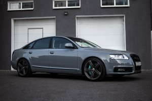
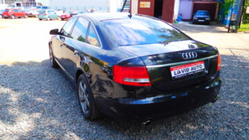
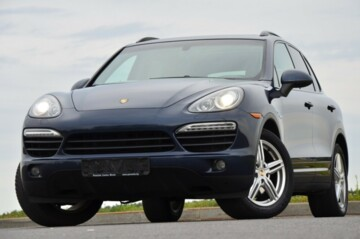
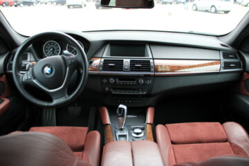
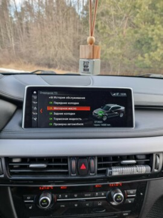
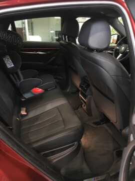

## Car Model Classification by photos

### Introdusing: Transfer Learning and Prediction model

### Classifying Car Models

#### Data Preparation
I used dataset which i made by myself, using site av.by for extract and load image. You can also download [entire dataset](https://github.com/bl4dylion4ik/car_photo_prediction). Dataset contain about 400.000 not processed img.
Also, if you want to download [processed dataset](https://github.com/bl4dylion4ik/car_photo_prediction), with most popular brand, you can download it too.
Original dataset contain folder with brand and modelname, like:
```project
│
└───Audi
│   │   47623453.jpg
│   │   43244243.jpg
│   |   ...
|
└───BMW
|   │   23425253.jpg
|   │   76543523.jpg
|   |   ...
|
|   ...
```
Three sample images are shown below.



<!-- 

 -->

While checking through the data, i observed that the dataset contained many unwanted images, e.g., pictures of wing mirrors, door handles, GPS panels, or lights, so i process dataset manually.
Examples of unwanted images can be seen below.



